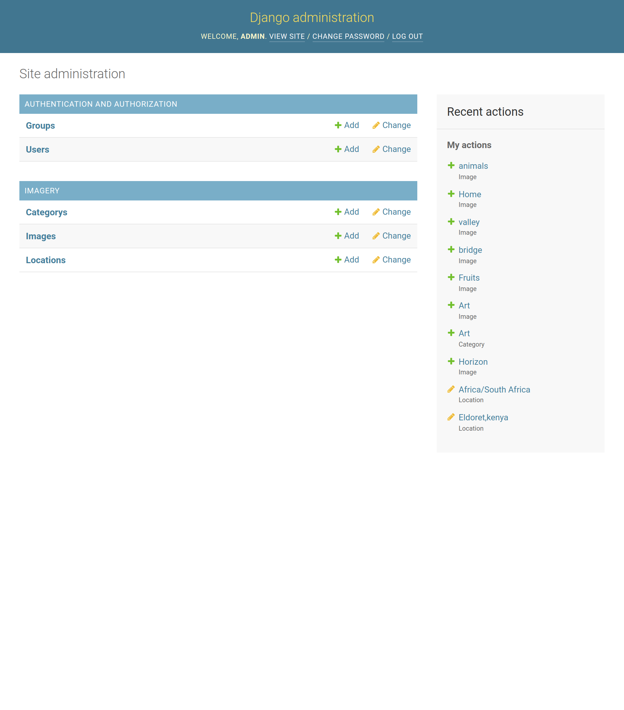

# Gallery Application

## Author
# Isaac Kiptoo Kilimo.

## Description
This is a web application written in Django. It is a photo gallery where users can view different photos based on where they were taken, search the photos by category, and copy the photo link to share with others. The administrator is in charge of populating the database.

## User Story
1. View different photos that interest them
2. Click a single image to expand it and view the details of that image
3. Search for different categories
4. View images based on the location they were taken.

## Behaviour Driven Development (BDD)

1. View by Location

|Behaviour 	           |    Input 	                 |       Output          |
|----------------------------------------------|:-----------------------------------:|-----------------------------:|       
| Click on the location you want from the tabs in the landing page  | location| Only images from that location are displayed  | 

2. Search by Category 

|Behaviour 	           |    Input 	                 |       Output          |
|----------------------------------------------|:-----------------------------------:|-----------------------------:|       
| Enter a search category on the search form   | searchTerm| Images that belong to that category are displayed  | 

3. Admin View

|Behaviour 	           |    Input 	                 |       Output          |
|----------------------------------------------|:-----------------------------------:|-----------------------------:|       
| Click on Admin on navigation bar | Username, Password| User is redirected to the admin page where they can manage the database  |  

4. Copy Image Link

|Behaviour 	           |    Input 	                 |       Output          |
|----------------------------------------------|:-----------------------------------:|-----------------------------:|       
| Click on the copy icon on the image modal that appears after clicking on the image | copy link| The image link is copied to clipboard  |  

## Setup/Installation Requirements
1. clone repository
     
2.  Type code based on the text editor you have and work on it.   

### Database
1. Set up Database,and put your username and password in the code

2. Make migrations
    python3.8 manage.py makemigrations picture

3. Migrate
   python3.8 manage.py migrate 
    
### Running the Application
1. Run main apllication
   * python3 manage.py runserver

2. Run tests    
   * python3.6 manage.py test imagery

###
1. Creating Admin Locally
    python manage.py createsuperuser. Then set username, email & password

2. Creating Django Admin   
     heroku run python manage.py createsuperuser. Then set username, email & password

## Technologies Used
* Python3.8
* Django 4.0
* javaScript
* Bootstrap
* PostgreSQL

## License -Copyright 

MIT License

Copyright © license 2022 ,Isaac kiptoo kilimo, student Moringa school.

## Authors Info/contacts

Github Profile - [Isaac kiptoo kilimo](https://github.com/Isaac-kiptoo-kilimo)

Email Address-[Isaac kiptoo kilimo] (isaac.kiptoo.kilimo@student.moringaschool.com)

Copyright © 2022

# project layout

### Homepage

### Admin 

